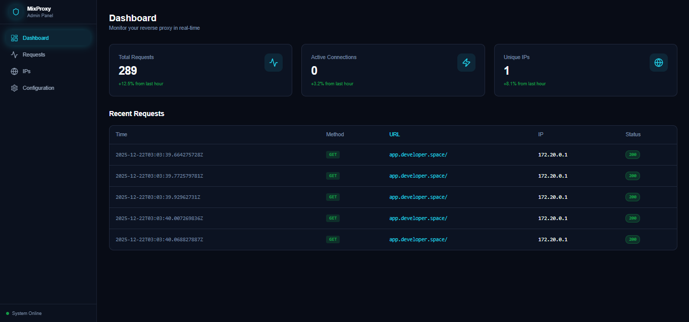
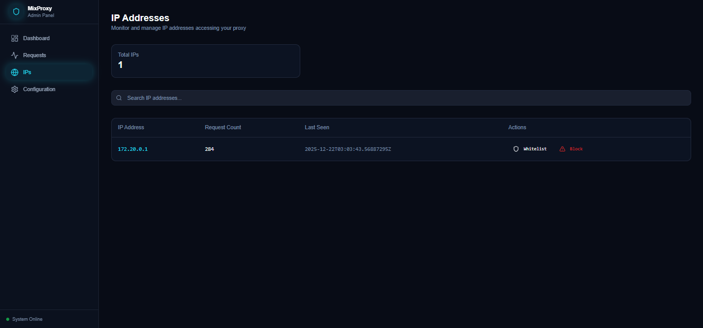
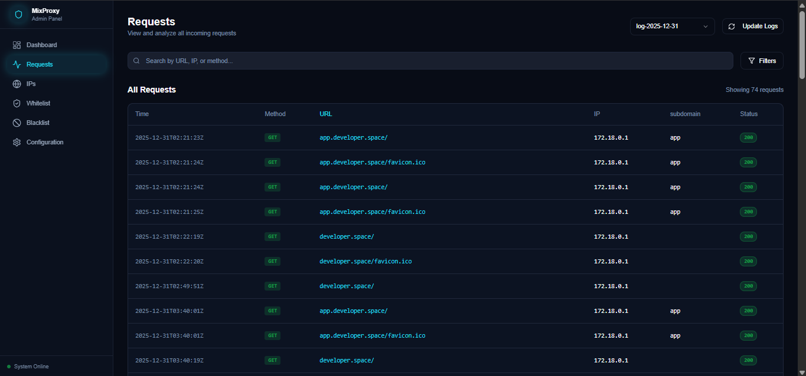
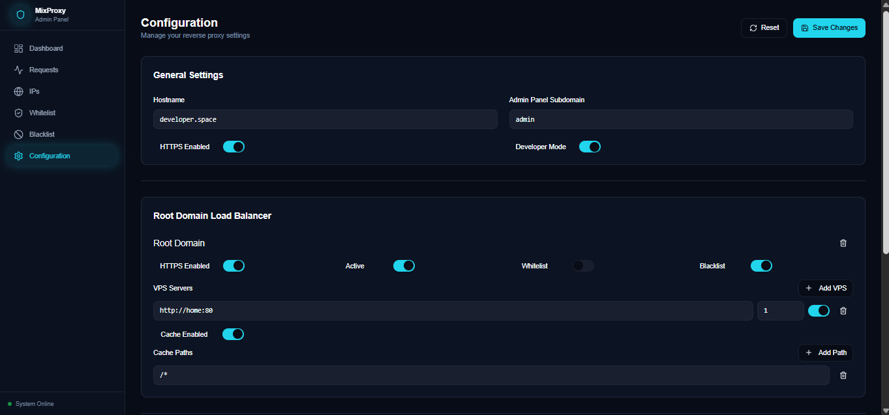

<div style="display: flex; justify-content: space-between; align-items: flex-end;">

<h1 style="margin-bottom: .2rem;">MixProxy</h1>

[](https://golang.org/)

</div>

MixProxy is a reverse proxy server written in Go, designed to efficiently route traffic to services with load balancing capabilities. It includes an administration panel for easy configuration and monitoring.

## Screenshots

### Dashboard


### IPs


### Requests


### Configuration



## Installation

To start using MixProxy, follow these simple steps:

1. **Download and install dependencies:**
   - On Linux/macOS:
    
    ```bash
     curl -o- https://raw.githubusercontent.com/Sebas572/MixProxy/refs/heads/main/setup.bash | bash
     ```
   - On Windows:
    
    ```ps1
     powershell -Command “& {Invoke-WebRequest https://raw.githubusercontent.com/Sebas572/MixProxy/refs/heads/main/setup.ps1 -OutFile setup.ps1; .\setup.ps1}”
     ```

2. **Configure certificates**:
   * If you are in development mode, you must run ./mixproxy and select `Create SSL certificates (developer)`.
   * If you have certificates, you must place them in the certs folder. The following two files are expected: localhost.pem and localhost-key.pem

3. **Start the services**:
   After installation, run the following command to start the proxy and the admin panel:
    ```bash
   docker compose up
   ```

3. **Access the services**:
   - The proxy will be available on the configured ports.
   - The admin panel can be accessed through your browser (check the configuration for the exact URL).
   - Default admin credentials: Username: `admin`, Password: `password`.


## Features

- **Load balancing**: intelligent distribution of traffic across multiple servers based on capacity weights
- **SSL/TLS support**: automatic HTTPS redirection and SSL certificate management
- **Subdomain routing**: subdomain-based traffic routing to different backend services.
- **Administration panel**: easy-to-use web interface for configuration and monitoring.
- **Docker support**: containerized deployment with Docker and Docker Compose.

## Architecture

MixProxy consists of three main components:

1. **Proxy core**: the main reverse proxy engine that handles HTTP/HTTPS traffic, load balancing, and routing.
2. **Management API**: RESTful API for managing proxy configuration and retrieving statistics.
3. **Administration panel**: React-based web interface for administrators to configure and monitor the proxy.

The proxy supports both root domain and subdomain-based routing, with configurable load balancers for each route. It automatically handles SSL termination and can generate self-signed certificates for development.

## Technologies Used

### BackEnd
- **Go**: Core proxy logic and server implementation
- **HTTP/1.1**: support
- **HTTP/2**: Coming soon support

### FrontEnd (Admin Panel)
- **React**: User interface framework
- **TypeScript**: Type-safe JavaScript
- **Vite**: Fast build tool and development server
- **Tailwind CSS**: Utility-first CSS framework
- **shadcn/ui**: Modern UI components


> [!WARNING]
> IP address logging has been temporarily disabled in order to obtain better benchmark performance. These logs (which were visible from the admin-panel [dashbaord, requests, and IPs]) will be reinstated in future updates.